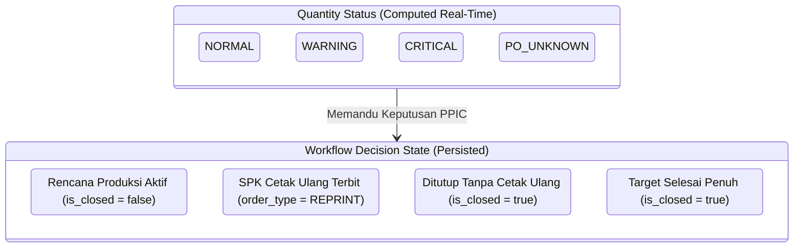

# PHASE 3.2 FINAL DESIGN LOCK
**Lost Wax Investment Casting Subsystem — Kanban PPIC**  
**Specification: Recovery Pool, Reprint SPK & Close Without Reprint Workflow**  
**Status: LOCKED SPECIFICATION — AUTHORITATIVE CONTRACT FOR IMPLEMENTATION**  
**Locked Date: 2026-08-28**

---

## 1. Executive Summary

Dokumen ini adalah **Final Design Lock (Kontrak Arsitektur & Implementasi)** untuk **Phase 3.2**. Dokumen ini mengunci seluruh spesifikasi teknis, skema database, aturan transisi status, penanganan konkurensi, semantik kuantitas, hak akses, perancangan antarmuka pengguna (UI/UX), dan matriks pengujian otomatis sebelum implementasi kode dimulai.

```
====================================================================================================
                              PHASE 3.2 DESIGN LOCK SPECIFICATION
====================================================================================================
 Aggregate Root                  : ProductionPlan
 Single Source of Truth Quantity : LostWaxQualityService::getProductionPlanQuantityBreakdown()
 Real-Time Derived Status        : NORMAL | WARNING | CRITICAL | PO_UNKNOWN
 Workflow Decision Status        : ACTIVE | REPRINT_ISSUED | CLOSED_WITHOUT_REPRINT
 UX Location                     : Tab [Recovery Pool] pada /lost-wax/print-orders/plans
 Core Database Changes           : order_type, reprint_reason, reprint_cycle pada lost_wax_print_orders
 Concurrency Guard               : DB::transaction() + ProductionPlan::lockForUpdate()
 Automated Test Scenarios        : 25 Skenario Adversarial Lengkap
 Gate Status                     : [X] DESIGN LOCKED
====================================================================================================
```

---

## 2. Business Rules

1. **Definisi Recovery Pool**:
   - Recovery Pool **bukanlah** daftar barang rusak fisik, daftar pohon, atau daftar scan barcode.
   - Recovery Pool adalah daftar **Production Plan** yang kuantitas usable-nya telah jatuh di bawah target komitmen produksi ($Q_{\text{usable}} < Q_{\text{planned}}$ atau $Q_{\text{usable}} < Q_{\text{po}}$) sehingga membutuhkan **intervensi dan keputusan manual oleh PPIC**.
2. **Tidak Ada SPK Otomatis (No Automatic Reprint)**:
   - Terjadinya cacat fisik tidak boleh secara otomatis memicu pembuatan SPK Cetak Ulang di latar belakang.
   - Perubahan status ke `WARNING` atau `CRITICAL` hanya memunculkan item di Recovery Pool.
   - Keputusan apakah akan **Mencetak Ulang (Reprint)** atau **Menutup Rencana (Close Without Reprint)** mutlak berada di tangan manusia (PPIC Scope Owner).
3. **Hard Boundary Production Code**:
   - SPK Reprint diterbitkan untuk `ProductionPlan` yang sama dan `code` (Kode Cust) yang sama.
   - Tidak boleh membuat Kode Cust baru atau memecah pool lilin.
   - Lilin hasil cetak reprint otomatis masuk ke pool FIFO yang sama pada `RangkaiExecutionService` dan dikonsumsi secara adil setelah lilin dari SPK lama habis.
4. **Immutability Historical Records**:
   - Penerbitan SPK Reprint atau penutupan rencana **tidak boleh** memodifikasi, menimpa, atau menghapus SPK lama, eksekusi cetak lama, pohon lama, riwayat defect lama, ataupun alokasi pohon yang sudah terjadi.

---

## 3. Canonical Quantity Formula

Satu-satunya sumber kebenaran perhitungan kuantitas untuk Recovery Pool adalah:
`\App\Services\LostWaxQualityService::getProductionPlanQuantityBreakdown(ProductionPlan $plan)`

$$\mathbf{Q_{\text{usable}}} = \sum \mathbf{Q_{\text{print\_good}}} - \sum \mathbf{Q_{\text{tree\_defect}}} - \sum \mathbf{Q_{\text{excess\_closed}}}$$

$$\mathbf{Q_{\text{usable}}} \equiv \mathbf{Q_{\text{standby}}} + \mathbf{Q_{\text{wip\_net}}} + \mathbf{Q_{\text{final\_usable}}}$$

- $\sum Q_{\text{print\_good}}$ : Total hasil cetak bagus dari seluruh SPK (awal + seluruh siklus reprint).
- $\sum Q_{\text{tree\_defect}}$ : Total cacat fisik pohon yang tercatat di `lost_wax_tree_defects` (assembly, layer 1–7, oven).
- $\sum Q_{\text{excess\_closed}}$ : Total kelebihan cetak yang secara eksplisit ditutup/dipangkas oleh PPIC.
- Defisit terhadap Target Internal: $\text{Deficit}_{\text{plan}} = \max(0, Q_{\text{planned}} - Q_{\text{usable}})$.
- Defisit terhadap Kontrak PO: $\text{Deficit}_{\text{po}} = Q_{\text{po}} \neq \text{null} \ ? \ \max(0, Q_{\text{po}} - Q_{\text{usable}}) : \text{null}$.

---

## 4. Quantity Status Matrix (Real-Time Derived)

Status kuantitas dievaluasi secara dinamis dan deterministik dari data aktual:

| Kondisi Data PO | Hubungan Kuantitas | Status Mutu | Implikasi Recovery Pool |
|---|---|:---:|---|
| **PO Tersedia ($Q_{\text{po}} \neq \text{null}$)** | $Q_{\text{usable}} \ge Q_{\text{planned}}$ | **`NORMAL`** | Target tercapai, tidak masuk Recovery Pool. |
| **PO Tersedia ($Q_{\text{po}} \neq \text{null}$)** | $Q_{\text{planned}} > Q_{\text{usable}} \ge Q_{\text{po}}$ | **`WARNING`** | Target internal kurang, PO aman. Masuk Recovery Pool. |
| **PO Tersedia ($Q_{\text{po}} \neq \text{null}$)** | $Q_{\text{usable}} < Q_{\text{po}}$ | **`CRITICAL`** | Komitmen customer terancam. Masuk Recovery Pool (Prioritas Tinggi). |
| **PO Kosong ($Q_{\text{po}} === \text{null}$)** | $Q_{\text{usable}} \ge Q_{\text{planned}}$ | **`NORMAL`** | Target tercapai, tidak masuk Recovery Pool. |
| **PO Kosong ($Q_{\text{po}} === \text{null}$)** | $Q_{\text{usable}} < Q_{\text{planned}}$ | **`PO_UNKNOWN` (WARNING)** | Masuk Recovery Pool dengan badge perhatian pengisian PO. **Dilarang menghasilkan false `CRITICAL`**. |

---

## 5. Workflow Decision State (Persisted)

Pemisahan tegas antara Status Kuantitas dan Status Keputusan Workflow:



- **`ACTIVE`**: Rencana produksi berjalan normal atau sedang dalam antrean keputusan recovery.
- **`REPRINT_ISSUED`**: PPIC telah menerbitkan SPK Cetak Ulang untuk mengkompensasi defisit.
- **`CLOSED_WITHOUT_REPRINT`**: PPIC secara sadar memutuskan tidak mencetak ulang (misal: customer menerima toleransi parsial). Field `closure_reason`, `closed_by`, `closed_at` terisi, dan rencana keluar dari Active Recovery Pool.

---

## 6. Recovery Pool Specification

### 6.1 Query & Filter Rules
Sebuah `ProductionPlan` masuk ke dalam query Active Recovery Pool jika dan hanya jika:
1. `is_closed === false`
2. $Q_{\text{usable}} < Q_{\text{planned}}$ (yaitu berstatus `WARNING`, `CRITICAL`, atau `PO_UNKNOWN`)
3. Sesuai dengan `product_scope` user PPIC yang sedang login.

### 6.2 Prioritas Tampilan
Tabel Recovery Pool diurutkan berdasarkan tingkat urgensi:
1. **`CRITICAL`** (Teratas — defisit PO terbesar berada paling atas).
2. **`WARNING` / `PO_UNKNOWN`** (Defisit plan terbesar berada di atas).
3. Timestamp kejadian defect terbaru (`updated_at DESC`).

---

## 7. Reprint Architecture

### 7.1 Struktur Dokumen SPK Reprint
- Dibuat entitas `LostWaxPrintOrder` baru:
  - `print_order_number`: `PC-YYYYMMDD-XXXX`
  - `order_type`: `'REPRINT'`
  - `reprint_reason`: string alasan yang diinput oleh PPIC (misal: *"Kompensasi 50 pcs retak lapisan di Layer 3"*).
  - `reprint_cycle`: integer berurutan (1 untuk siklus recovery pertama, 2 untuk siklus kedua, dst.).
  - `created_by`: ID user PPIC yang membuat.
- Baris SPK (`LostWaxPrintOrderLine`):
  - `production_plan_id`: Menunjuk ke `ProductionPlan` yang sama.
  - `qty_ordered`: Kuantitas cetak ulang yang disetujui.
  - Snapshot `code`, `customer`, `item_name`, `size`, `aisi`.

### 7.2 Nilai Kuantitas Default
- Nilai default kuantitas pada form/modal reprint: **$\text{Deficit}_{\text{plan}} = Q_{\text{planned}} - Q_{\text{usable}}$**.
- PPIC diperbolehkan mengubah kuantitas (misal: melebihkan 10 pcs untuk buffer).
- Jika input kuantitas melebihi defisit plan, UI menampilkan informasi visual bahwa PPIC melakukan over-recovery.

---

## 8. Close Without Reprint Specification

### 8.1 Alur Penutupan
Ketika PPIC memutuskan tidak mencetak ulang:
1. Form modal mewajibkan pengisian `closure_reason` (min. 5 karakter, misal: *"Customer PO toleransi -5%, pengiriman parsial disetujui"*).
2. Sistem mengeksekusi update atomik pada `ProductionPlan`:
   - `is_closed = true`
   - `closure_reason = $request->closure_reason`
   - `closed_by = auth()->id()`
   - `closed_at = now()`
3. Rencana seketika keluar dari Active Recovery Pool.
4. Seluruh SPK, pohon, dan riwayat defect tetap tersimpan permanen untuk audit.

### 8.2 Idempotensi Penutupan
Jika sebuah rencana yang sudah ditutup dicoba untuk ditutup kembali, operasi ditangani secara idempoten tanpa menimbulkan duplikasi atau error fatal.

---

## 9. Multiple Recovery Cycles (Siklus Recovery Berulang)

Arsitektur Phase 3.2 mendukung siklus recovery berulang secara matematis dan auditabel:

```
[Siklus 0] Target: 1200 | Cetak: 1200 | Rusak: 50 | Usable: 1150 | Defisit: 50 -> WARNING
      ↓
[Aksi PPIC] Terbitkan SPK Reprint Cycle #1 (qty: 50)
      ↓
[Siklus 1] Hasil Cetak Reprint: 50 | Cacat Baru di Dipping: 20
           Total Cetak Good: 1250 | Total Defect: 70 | Usable: 1180 | Defisit Baru: 20 -> WARNING
      ↓
[Recovery Pool] Rencana otomatis tetap tampil dengan label "Defisit: 20 pcs (Reprint Cycle #1 Recorded)"
      ↓
[Aksi PPIC] Pilihan: Terbitkan SPK Reprint Cycle #2 (qty: 20) ATAU [Tutup Tanpa Reprint]
```

Traceability query dapat mengidentifikasi setiap siklus secara presisi melalui kolom `reprint_cycle` pada dokumen SPK.

---

## 10. Concurrency & Locking Specification

Untuk mencegah race condition saat multiple user berinteraksi simultan:

```php
DB::transaction(function () use ($planId, $reprintData) {
    // 1. Lock record ProductionPlan
    $plan = ProductionPlan::lockForUpdate()->findOrFail($planId);

    // 2. Guard status penutupan
    if ($plan->is_closed) {
        throw new \DomainException("Rencana produksi ini sudah ditutup oleh user lain.");
    }

    // 3. Guard duplikasi SPK reprint aktif
    $hasActiveDraftReprint = $plan->printOrderLines()
        ->whereHas('printOrder', function ($q) {
            $q->where('order_type', 'REPRINT')
              ->whereIn('status', ['DRAFT', 'ISSUED']);
        })->exists();

    if ($hasActiveDraftReprint) {
        throw new \DomainException("Sudah ada SPK Cetak Ulang aktif yang sedang berjalan untuk rencana ini.");
    }

    // 4. Hitung ulang cycle number & kuantitas di server (jangan percaya raw browser payload)
    $cycleNumber = $plan->printOrderLines()
        ->whereHas('printOrder', fn($q) => $q->where('order_type', 'REPRINT'))
        ->count() + 1;

    // 5. Create LostWaxPrintOrder & Line
    ...
});
```

---

## 11. Idempotency & Duplicate Prevention

1. **CSRF & Form Tokens**: Setiap modal aksi memuat token CSRF standar Laravel.
2. **Double-Click Shield (Frontend)**: Tombol aksi mendisable dirinya sendiri seketika ditekan (`this.disabled = true`, menambahkan spinner).
3. **Database Unique Numbering**: Penomoran SPK `print_order_number` memiliki index unik di level database.
4. **Active Reprint Mutex**: Server menolak pembuatan SPK reprint baru jika SPK reprint sebelumnya masih berstatus `DRAFT` atau `ISSUED`.

---

## 12. Traceability Matrix 5W+1H

Setiap keputusan recovery dapat menjawab 6 pertanyaan audit secara instan:

| Dimensi Audit | Pertanyaan | Sumber Data di Database |
|---|---|---|
| **WHO** | Siapa yang memutuskan reprint/close? | `lost_wax_print_orders.created_by` / `production_plans.closed_by` |
| **WHEN** | Kapan keputusan dieksekusi? | `lost_wax_print_orders.created_at` / `production_plans.closed_at` |
| **WHAT** | Tindakan apa yang diambil? | `order_type = 'REPRINT'` dengan `qty_ordered` ATAU `is_closed = true` |
| **WHY** | Apa alasan teknis keputusan tersebut? | `lost_wax_print_orders.reprint_reason` / `production_plans.closure_reason` |
| **HOW MUCH** | Berapa kuantitas yang diminta? | `lost_wax_print_order_lines.qty_ordered` |
| **WHICH PLAN** | Untuk kode produksi mana? | `production_plans.code` (`production_plan_id`) |
| **WHICH CYCLE**| Siklus recovery keberapa? | `lost_wax_print_orders.reprint_cycle` (1, 2, 3...) |

---

## 13. Authorization & RBAC Specification

- **Role `ppic` (dengan `product_scope` yang sesuai)**:
  - Melihat tab Recovery Pool untuk scope produknya.
  - Membuka modal dan mengisi `po_quantity`.
  - Menerbitkan SPK Cetak Ulang (`order_type = 'REPRINT'`).
  - Menutup rencana produksi tanpa cetak ulang (`is_closed = true`).
- **Role `admin`**:
  - Hak pantau penuh (Read-Only Oversight). Tombol aksi dimatikan / read-only.
- **Role `operator` / `spv`**:
  - Dilarang mengakses rute penutupan dan penerbitan SPK (HTTP 403 Forbidden).

---

## 14. UX & UI Specification

### 14.1 Tab Navigasi pada `/lost-wax/print-orders/plans`
Tab navigasi di atas tabel Print Planning diperluas menjadi 3 tab:
1. `[ RENCANA CETAK ]` (Active Plans dengan sisa kuantitas awal)
2. `[ RECOVERY POOL (N) ]` (Badge merah/kuning jika ada $N$ rencana defisit)
3. `[ DOKUMEN CETAK ]` (Daftar seluruh SPK yang pernah diterbitkan)

### 14.2 Kolom Tabel Recovery Pool
1. **Kode Cust**: Kode produksi + link detail riwayat.
2. **Product Name & AISI**: Nama barang dan jenis paduan.
3. **Customer & PO**: Nomor PO dan kuantitas PO (jika kosong, tombol inline `[+ Isi PO]`).
4. **Plan Qty**: Target kuantitas internal.
5. **Usable Qty**: Kuantitas usable saat ini (warna indikator hijau/kuning/merah).
6. **Defisit Plan**: $\max(0, Q_{\text{planned}} - Q_{\text{usable}})$.
7. **Defisit PO**: $\max(0, Q_{\text{po}} - Q_{\text{usable}})$ (atau "-" jika PO aman/null).
8. **Status Mutu**: Badge `CRITICAL` (Rose), `WARNING` (Amber), atau `PO_UNKNOWN` (Slate).
9. **Keterangan Penjelasan**:
   - Misal: *"Target internal kurang 50 pcs, PO masih aman."*
   - Misal: *"PO terancam kurang 20 pcs! Total defisit plan 120 pcs."*
10. **Aksi**:
    - Tombol `[+ Buat SPK Reprint]` (Membuka modal terisi default defisit plan).
    - Tombol `[Tutup Rencana]` (Membuka modal input alasan penutupan).

---

## 15. Database Schema & Migration Specification

### 15.1 Tabel `lost_wax_print_orders`
Penambahan 2 kolom baru pada tabel `lost_wax_print_orders`:
```php
if (Schema::hasTable('lost_wax_print_orders')) {
    Schema::table('lost_wax_print_orders', function (Blueprint $table) {
        if (! Schema::hasColumn('lost_wax_print_orders', 'order_type')) {
            $table->string('order_type', 20)->default('REGULAR')->after('status');
        }
        if (! Schema::hasColumn('lost_wax_print_orders', 'reprint_reason')) {
            $table->string('reprint_reason', 255)->nullable()->after('order_type');
        }
        if (! Schema::hasColumn('lost_wax_print_orders', 'reprint_cycle')) {
            $table->unsignedSmallInteger('reprint_cycle')->default(0)->after('reprint_reason');
        }
    });
}
```

- `order_type`: `'REGULAR'` untuk SPK awal, `'REPRINT'` untuk SPK recovery.
- `reprint_reason`: Alasan pembuatan SPK reprint.
- `reprint_cycle`: `0` untuk regular, `1, 2, 3...` untuk siklus reprint.
- Index: `index(['order_type', 'created_at'])`.

---

## 16. Route Specification

Rute yang didaftarkan pada `routes/web.php` (di dalam middleware `auth`):

```php
Route::middleware(['auth'])->prefix('lost-wax')->name('lost-wax.')->group(function () {
    // 1. Recovery Pool Tab View (handled via PrintOrderController::plans with tab=recovery)
    Route::get('print-orders/plans', [PrintOrderController::class, 'plans'])->name('print-orders.plans');

    // 2. Store Reprint SPK
    Route::post('print-orders/reprint', [PrintOrderController::class, 'storeReprint'])->name('print-orders.reprint.store');

    // 3. Close Production Plan Without Reprint
    Route::post('production-plans/{plan}/close-recovery', [PrintOrderController::class, 'closeWithoutReprint'])->name('production-plans.close-recovery');

    // 4. Quick Update PO Quantity
    Route::put('production-plans/{plan}/update-po', [PrintOrderController::class, 'updatePoQuantity'])->name('production-plans.update-po');
});
```

---

## 17. Controller & Service Responsibilities

1. **`LostWaxQualityService`**:
   - Menghitung breakdown kuantitas kanonikal untuk setiap `ProductionPlan`.
   - Menyediakan method bantuan: `getRecoveryPoolPlans(?string $productScope = null)`.
2. **`PrintOrderController`**:
   - `plans()`: Memuat tab `plans`, `recovery`, dan `orders`.
   - `storeReprint()`: Validasi, lock transaksi, penomoran SPK, pencatatan `order_type = 'REPRINT'`, `reprint_cycle`, dan baris SPK.
   - `closeWithoutReprint()`: Validasi alasan penutupan, lock transaksi, pencatatan `is_closed = true`.
   - `updatePoQuantity()`: Validasi angka PO dan pembaruan pada `ProductionPlan`.
3. **`RangkaiExecutionService`**:
   - Mengambil seluruh baris SPK (reguler dan reprint) untuk kode yang sama dan mengonsumsi lilin secara FIFO murni.

---

## 18. Adversarial Test Matrix (25 Skenario Wajib)

| # | Skenario Uji | Kondisi Input | Ekspektasi Output & Verifikasi |
|---|---|---|---|
| **1** | **NORMAL State Exclusion** | Plan 1200, PO 1000, Cetak 1280, Defect 40 | Usable 1240. **TIDAK muncul di Recovery Pool**. |
| **2** | **WARNING State Inclusion** | Plan 1200, PO 1000, Cetak 1280, Defect 130 | Usable 1150. **Muncul di Pool** (Defisit Plan = 50, Defisit PO = 0). |
| **3** | **CRITICAL State Inclusion** | Plan 1200, PO 1000, Cetak 1200, Defect 250 | Usable 950. **Muncul di Pool** (Defisit PO = 50, Defisit Plan = 250). |
| **4** | **PO UNKNOWN Handling** | Plan 1200, PO NULL, Cetak 1200, Defect 50 | Usable 1150. **Muncul di Pool** dengan badge `PO_UNKNOWN` (Bukan CRITICAL). |
| **5** | **Exact Plan Target Boundary** | Plan 1200, PO 1000, Cetak 1200, Defect 0 | Usable 1200. **Keluar dari Recovery Pool**. |
| **6** | **Exact PO Target Boundary** | Plan 1200, PO 1000, Cetak 1200, Defect 200 | Usable 1000. **Muncul di Pool** sebagai WARNING (Defisit PO = 0). |
| **7** | **Plan Deficit Isolation** | Plan 1200, PO 1000, Cetak 1250, Defect 60 | Usable 1190. Defisit Plan = 10, PO Aman. |
| **8** | **PO Deficit Breach Alert** | Plan 1200, PO 1000, Cetak 1250, Defect 260 | Usable 990. Defisit PO = 10. Prioritas CRITICAL. |
| **9** | **Reprint SPK Creation** | Defisit 50 pcs, PPIC klik Buat SPK Reprint | Dokumen SPK baru terbit: `order_type = REPRINT`, `qty_ordered = 50`, `cycle = 1`. |
| **10**| **Reprint Execution Defect** | Reprint 50 dicetak, saat dipping cacat 20 pcs | Total Good = 1250, Total Defect = 70, Usable = 1180. Defisit baru = 20. |
| **11**| **Second Recovery Cycle** | PPIC reprint 20 pcs lagi, hasil cetak 20, defect 0 | Total Good = 1270, Total Defect = 70, Usable = 1200. Rencana keluar dari Pool. |
| **12**| **Close Without Reprint** | PPIC input alasan: *"Disetujui kirim 1150 pcs"* | `is_closed = true`, `closure_reason` tersimpan, keluar dari Active Pool. |
| **13**| **Reprint Then Close** | Selesai reprint 40 pcs, sisa 10 pcs ditutup | `is_closed = true`. Riwayat SPK reprint tetap utuh dan terbaca. |
| **14**| **Close Then Reprint Attempt**| Submit form reprint pada rencana yang sudah closed | Request ditolak (HTTP 422 / Validation Error). |
| **15**| **Concurrent Double Reprint** | Dua request reprint masuk pada milidetik yang sama | Transaksi kedua diblokir mutex. Hanya 1 SPK yang tercipta. |
| **16**| **Concurrent Close Requests** | Dua request penutupan masuk bersamaan | Ditangani secara idempoten tanpa error database. |
| **17**| **PO Late Update** | Rencana defisit PO NULL diisi PO = 1000 | Status seketika berubah dari `PO_UNKNOWN` ke `WARNING` real-time. |
| **18**| **Excess Closed Isolation** | Cetak 1300, Plan 1200, Excess Closed 100 | Usable 1200. Tidak memicu false recovery. |
| **19**| **Cancelled Tree Safety** | Pohon 32 pcs dibatalkan sebelum scan L1 | Material tetap di Standby. Usable tidak terpotong. |
| **20**| **Legacy Data Safety** | Rencana lama tanpa record defect | Usable = 100% cetak awal. Zero false recovery. |
| **21**| **Multi-Line FIFO Tree** | Pohon 30 pcs dari Line A (4) & Line B (26) | Cacat 3 pcs dihitung tepat 1 kali. Tidak ada double deduction. |
| **22**| **Cross-Code Isolation** | Dua rencana terpisah untuk item yang sama | Terisolasi per ID rencana. Nol kontaminasi antar-kode. |
| **23**| **Duplicate Form Submit** | User klik tombol submit berkali-kali | Frontend disable guard + server idempotency mencegah SPK dobel. |
| **24**| **Browser Refresh Resubmit** | User refresh halaman setelah submit reprint | PRG (Post-Redirect-Get) pattern mencegah resubmission. |
| **25**| **Full Traceability Chain** | Tracing dari PO awal hingga pohon hasil reprint | Rantai audit 5W+1H lengkap dari hulu ke hilir. |

---

## 19. Migration Plan

1. **File**: `database/migrations/2026_08_28_150000_add_reprint_fields_to_lost_wax_print_orders_table.php`
2. **Karakteristik**:
   - Menggunakan `Schema::hasTable` dan `Schema::hasColumn` guards.
   - Kolom `order_type` bertipe string/enum dengan default `'REGULAR'` (semua record lama otomatis menjadi `REGULAR`).
   - Kolom `reprint_reason` bertipe nullable string.
   - Kolom `reprint_cycle` bertipe unsignedSmallInteger default `0`.
   - Zero downtime, non-blocking, dan 100% aman untuk rollback.

---

## 20. Implementation Risks & Mitigation

| Risiko Teknis / Bisnis | Dampak | Strategi Mitigasi Terkunci |
|---|---|---|
| **Double Reprint Race Condition** | Tercipta 2 SPK reprint untuk defisit yang sama | `DB::transaction()` + `ProductionPlan::lockForUpdate()` + active draft check. |
| **Pencetakan Berlebih (Over-Reprint)** | Biaya cetak lilin membengkak | Default input = defisit plan, disertai warning visual jika user melebihkan kuantitas. |
| **Kontaminasi Lilin FIFO** | Lilin reprint tercampur ke kode lain | Isolasi ketat `where('code', $code)` pada `RangkaiExecutionService`. |
| **Penutupan Rencana Siluman** | Rencana hilang tanpa pertanggungjawaban | Validasi form wajib menyertakan alasan penutupan (`closure_reason`). |

---

## 21. Implementation Sequence

Pelaksanaan Phase 3.2 akan dijalankan dalam 5 langkah berurutan:
1. **Langkah 1**: Buat migration penambahan kolom `order_type`, `reprint_reason`, `reprint_cycle` pada `lost_wax_print_orders`.
2. **Langkah 2**: Perbarui model `LostWaxPrintOrder` (fillable, casts, helper accessors).
3. **Langkah 3**: Implementasikan controller actions di `PrintOrderController` (`storeReprint`, `closeWithoutReprint`, `updatePoQuantity`) dan daftarkan rute pada `routes/web.php`.
4. **Langkah 4**: Perbarui UI Blade `resources/views/lost-wax/print-orders/plans.blade.php` dengan penambahan tab `[Recovery Pool]` beserta modal aksi.
5. **Langkah 5**: Buat dan jalankan automated feature test suite `tests/Feature/LostWax/RecoveryPoolAndReprintTest.php` (25 skenario wajib).

---

## 22. Final Design Lock Declaration

```
====================================================================================================
FINAL GATE VERDICT: [X] DESIGN LOCKED — READY FOR IMPLEMENTATION APPROVAL
====================================================================================================
```

*Dokumen ini resmi terkunci. Tidak ada asumsi yang menggantung dan tidak ada konflik arsitektural. Sistem siap memasuki tahap implementasi Phase 3.2 begitu user memberikan izin implementasi.*
