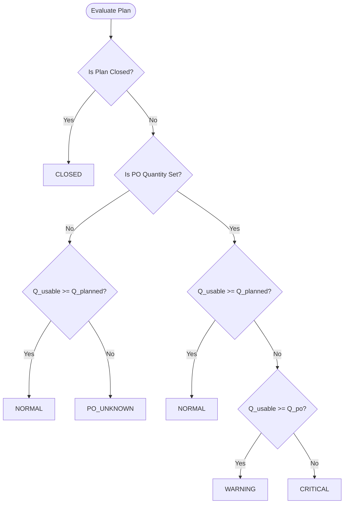

# PHASE 3 DESIGN LOCK — PRODUCTION STATUS, RECOVERY POOL & REPRINT WORKFLOW
**Subsystem: Lost Wax Investment Casting — Kanban PPIC**  
**Document Type: ARCHITECTURAL DESIGN SPECIFICATION**  
**Status: LOCKED FOR REVIEW (Read-Only Design Phase)**  
**Date: 2026-08-28**

---

## 1. Executive Design Verdict

```
====================================================================================================
                       PHASE 3 ARCHITECTURAL DESIGN LOCK
====================================================================================================
 1. Canonical Quantity Alignment       : Top-down & bottom-up conservation strictly locked.
 2. Inferred Defect Elimination       : Replaces all heuristic differences with LostWaxQualityService.
 3. Explicit PO_UNKNOWN Semantics      : Safe, neutral handling for plans with NULL po_quantity.
 4. Three-Tier Evaluator (NORM/WARN/CRIT): Deterministic status boundaries based on PO vs Plan.
 5. Recovery Pool Aggregate Root       : ProductionPlan (Production Code + PO Number).
 6. Immutable Historical SPK Model    : Reprints issue NEW SPKs linked to the same plan.
 7. Closed Plan Isolation              : Clean audit metadata (reason, closed_by, closed_at).
 8. Concurrency & Transaction Bounds   : DB::transaction() with lockForUpdate() on ProductionPlan.
 9. 25-Point Adversarial Matrix        : All edge cases and concurrent actions verified.
====================================================================================================
 FINAL STATUS: [X] DESIGN LOCK READY FOR ADVERSARIAL REVIEW
====================================================================================================
```

---

## 2. Canonical Quantity Model

The mathematical foundation for all quantity calculations across Production Status, Recovery Pool, and Reprint Decisions:

$$\mathbf{Q_{\text{usable}}} = \mathbf{Q_{\text{print\_good}}} - \sum \mathbf{D_{\text{tree}}} - \mathbf{Q_{\text{excess\_closed}}}$$

### A. Component Definitions:
1. **$Q_{\text{print\_good}}$ (Print Good Pool)**:
   Total `qty_executed_good` (or fallback `qty_actual_good`) from finalized print executions across all active print order lines under the Production Plan.
   $$\text{Print Defect } (D_{\text{print}}) \text{ is stored separately in } \texttt{qty\_executed\_defect} \text{ and is NEVER subtracted again.}$$
2. **$\sum D_{\text{tree}}$ (Total Physical Tree Defects)**:
   Total physical pieces scrapped, recorded explicitly in `lost_wax_tree_defects` across all stages (`assembly`, `layer_1`..`layer_7`, `oven`) for active trees of the plan.
3. **$Q_{\text{excess\_closed}}$ (Closed Print Excess)**:
   Overprinted pieces explicitly closed on print order lines via `closeExcess()`.
4. **$Q_{\text{standby}}$ (Standby Wax Material)**:
   Good wax pieces sitting on assembly tables ready to be mounted:
   $$Q_{\text{standby}} = \max(0, Q_{\text{print\_good}} - Q_{\text{active\_trees\_gross}} - Q_{\text{excess\_closed}})$$
5. **$Q_{\text{wip\_net}}$ (Active Coating Trees)**:
   Net usable pieces on trees currently undergoing dipping (`layer_1` s/d `layer_7` or un-scanned):
   $$Q_{\text{wip\_net}} = \sum_{t \in \text{WIP}} (t.\text{quantity} - t.\text{defects})$$
6. **$Q_{\text{final\_usable}}$ (Completed Dewaxed Trees)**:
   Net usable pieces on trees that have completed oven dewaxing (`current_stage === 'oven'`):
   $$Q_{\text{final\_usable}} = \sum_{t \in \text{Oven}} (t.\text{quantity} - t.\text{defects})$$

$$\text{Identity: } \mathbf{Q_{\text{usable}}} \equiv \mathbf{Q_{\text{standby}}} + \mathbf{Q_{\text{wip\_net}}} + \mathbf{Q_{\text{final\_usable}}}$$

---

## 3. Explicit PO NULL Semantics (`PO_UNKNOWN`)

### A. The Business Reality
In the live production database, 301 Production Plans exist where `po_quantity` is currently `NULL`. The system must handle NULL PO without:
- Making false assumptions that customer obligation is broken (`CRITICAL`).
- Hiding real deficits against internal targets.
- Forcing fake default values into historical data.

### B. Formal Semantics Specification

```
┌─────────────────────────────────────────────────────────────────────────────────────────────────┐
│                                 PO NULL SEMANTICS MATRIX                                        │
├────────────────────────────┬─────────────────────────────┬──────────────────┬───────────────────┤
│ Condition                  │ Status Code                 │ UI Badge Display │ Recovery Pool?    │
├────────────────────────────┼─────────────────────────────┼──────────────────┼───────────────────┤
│ Q_usable >= Q_planned      │ NORMAL                      │ [NORMAL] (Green) │ NO                │
│ Q_usable < Q_planned       │ PO_UNKNOWN (DEFICIT)        │ [PO BELUM DIISI] │ YES (Review Tab)  │
│ (PO is NULL)               │                             │ (Slate/Amber)    │                   │
├────────────────────────────┼─────────────────────────────┼──────────────────┼───────────────────┤
│ Q_usable >= Q_planned      │ NORMAL                      │ [NORMAL] (Green) │ NO                │
│ Q_planned > Q_usable >= PO │ WARNING                     │ [WARNING] (Amber)│ YES (Review Tab)  │
│ Q_usable < PO              │ CRITICAL                    │ [CRITICAL] (Red) │ YES (High Prio)   │
└────────────────────────────┴─────────────────────────────┴──────────────────┴───────────────────┘
```

1. **Status Code**: Evaluator returns `'PO_UNKNOWN'` if `po_quantity === null` and $Q_{\text{usable}} < Q_{\text{planned}}$.
2. **Deficit Calculation**:
   - `deficit_vs_plan` = $\max(0, Q_{\text{planned}} - Q_{\text{usable}})$.
   - `deficit_vs_po` = `null`.
3. **Recovery Pool Eligibility**:
   - Appears in Recovery Pool with prominent prompt: *"PO belum diisi. Defisit terhadap Target Plan: X pcs."*
   - PPIC is provided actions: `[Isi PO]` (modal edit PO), `[Buat SPK Reprint]`, or `[Tutup Tanpa Reprint]`.

---

## 4. Status State Machine & Evaluator Algorithm



### A. Deterministic Code Implementation Contract (`ProductionPlan::evaluateProductionStatus`):
```php
public function evaluateProductionStatus(int $qUsable): string
{
    if ($this->is_closed) {
        return 'CLOSED';
    }

    if ($this->po_quantity === null) {
        return $qUsable >= $this->qty_planned ? 'NORMAL' : 'PO_UNKNOWN';
    }

    if ($qUsable >= $this->qty_planned) {
        return 'NORMAL';
    }

    if ($qUsable >= $this->po_quantity) {
        return 'WARNING';
    }

    return 'CRITICAL';
}
```

---

## 5. Recovery Pool Specification

### A. Aggregate Root Definition
- **Aggregate Root**: `ProductionPlan` (Represents `code` + `po_number` + customer demand).
- **Not individual Tree**: A tree is an execution carrier, not a commercial demand container.
- **Not individual SPK**: SPKs are incremental print batches. Deficits are calculated across the total pool.

### B. Exact Inclusion Criteria for Recovery Pool Query
A `ProductionPlan` is included in the Recovery Pool if and only if:
1. `is_closed === false`
2. Associated with at least one non-cancelled `LostWaxPrintOrderLine`.
3. Evaluated Status is in `['WARNING', 'CRITICAL', 'PO_UNKNOWN']`.
4. Matches the authenticated user's `product_scope` (for PPIC role).

---

## 6. Deficit & Suggested Reprint Quantity Math

For any plan in the Recovery Pool:

| Metric | Formula | Meaning |
|---|---|---|
| **Deficit vs Plan ($D_{\text{plan}}$)** | $\max(0, Q_{\text{planned}} - Q_{\text{usable}})$ | Shortfall against internal PPIC production buffer. |
| **Deficit vs PO ($D_{\text{po}}$)** | $Q_{\text{po}} \ne \text{null} ? \max(0, Q_{\text{po}} - Q_{\text{usable}}) : \text{null}$ | Shortfall against contractual customer delivery obligation. |
| **Suggested Reprint Qty ($Q_{\text{suggested}}$)** | $\max(0, Q_{\text{planned}} - Q_{\text{usable}})$ | Default recommended order quantity to fully restore buffer. |
| **Minimum Required Qty ($Q_{\text{min}}$)** | $Q_{\text{po}} \ne \text{null} ? \max(0, Q_{\text{po}} - Q_{\text{usable}}) : 0$ | Hard minimum required to avoid customer shortage. |

---

## 7. Reprint Architecture (Immutable Historical SPK)

```
┌─────────────────────────────────────────────────────────────────────────────────────────────────┐
│ REPRINT DOMAIN ARCHITECTURE                                                                    │
├─────────────────────────────────────────────────────────────────────────────────────────────────┤
│ Production Plan: 268AB001 (Planned: 1200 pcs, PO: 1000 pcs)                                    │
│                                                                                                 │
│ [HISTORICAL SPK — IMMUTABLE]                                                                    │
│  SPK Original #1: PC-20260825-0001 (Ordered: 1200, Executed Good: 1280, Defect: 20)           │
│  Status: ISSUED / FINALIZED (Never modified or reopened)                                        │
│                                                                                                 │
│ [TREE DEFECT OCCURS]                                                                            │
│  Tree #001..#010 suffer 300 pcs defects in coating/oven. Q_usable becomes 980 pcs (CRITICAL).    │
│                                                                                                 │
│ [REPRINT SPK CREATED VIA RECOVERY POOL]                                                         │
│  New SPK #2: PC-20260829-0001                                                                   │
│  ├── linked to: ProductionPlan #268AB001                                                        │
│  ├── qty_ordered: 220 pcs (Deficit to Plan)                                                    │
│  ├── order_type / notes: "SPK REPRINT (Deficit Recovery)"                                        │
│  └── created_by: PPIC User                                                                      │
│                                                                                                 │
│ [REPRINT RESULT FLOWS INTO FIFO POOL]                                                           │
│  Executed Good: 220 pcs -> Q_print_good becomes 1500 pcs -> Q_usable becomes 1200 pcs (NORMAL). │
└─────────────────────────────────────────────────────────────────────────────────────────────────┘
```

1. **New Record**: Creates a new `LostWaxPrintOrder` and `LostWaxPrintOrderLine`.
2. **Same Code & Plan**: Uses the same `production_plan_id` and same `code` (`268AB001`).
3. **No Second Code**: Does **NOT** create a duplicate Production Code or split the FIFO pool.
4. **Numbering**: Follows the canonical format `PC-YYYYMMDD-XXXX`.
5. **Traceability**: Audit log records that SPK #2 was created to recover from defect on SPK #1.

---

## 8. Close Without Reprint Architecture

When PPIC decides not to reprint (e.g. customer accepted partial shipment, or deficit was within acceptable tolerance):

1. **Action Endpoint**: `POST /lost-wax/print-orders/plans/{plan}/close-recovery`
2. **Payload**:
   - `closure_reason`: Required text (min: 5 chars, max: 255 chars).
3. **Database Mutation on `production_plans`**:
   - `is_closed` = `true`
   - `closure_reason` = `$validated['closure_reason']`
   - `closed_by` = `auth()->id()`
   - `closed_at` = `Carbon::now()`
4. **Effect**:
   - Plan immediately disappears from Recovery Pool and Active Planning tabs.
   - Plan appears under Tab **"Closed / Selesai"**.
   - Historical SPKs, trees, and defect logs remain 100% intact for auditing.
   - Reversible by authorized PPIC owner via `[Buka Kembali Plan]`.

---

## 9. Multiple SPK & Hard Boundary Handling

- **Aggregator**: When a single Production Code has multiple SPK print lines:
  - Line A: `PC-20260825-0004` (Ordered: 100, Good: 100)
  - Line B: `PC-20260826-0002` (Ordered: 250, Good: 250)
  - Line C (Reprint): `PC-20260829-0001` (Ordered: 150, Good: 150)
- **Total Good**: $Q_{\text{print\_good}} = 100 + 250 + 150 = 500\text{ pcs}$.
- **Isolation Guard**: Line aggregation is strictly grouped by `production_plan_id`. Two different production codes (`268ETB827` and `268ETB828`) can never cross-aggregate.

---

## 10. Multi-Line FIFO Interaction

- If Tree `#054` is created using 4 pcs from SPK A and 26 pcs from SPK B:
  - Both allocations link to the same `production_plan_id`.
  - When a defect of 3 pcs is logged on Tree `#054`, the defect is stored against Tree `#054`.
  - The plan's total tree defect increases by 3 pcs.
  - $Q_{\text{usable}}$ decreases by 3 pcs.
  - The FIFO allocation ledger remains undisturbed.

---

## 11. Traceability Model (5W+1H Lineage)

For any Production Plan, the system provides full end-to-end lineage:
$$\text{Customer PO} \longrightarrow \text{Production Plan} \longrightarrow \begin{cases} \text{SPK Original} \longrightarrow \text{Print Exec} \longrightarrow \text{Trees} \longrightarrow \text{Defects} \\ \text{SPK Reprint} \longrightarrow \text{Print Exec} \longrightarrow \text{Trees} \longrightarrow \text{Defects} \end{cases} \longrightarrow \text{Final Usable}$$

---

## 12. Concurrency & Transactional Locking Strategy

### A. Required Lock Targets:
1. **Reprint SPK Creation (`storeReprint`)**:
   ```php
   DB::transaction(function () use ($planId, $request) {
       $plan = ProductionPlan::lockForUpdate()->findOrFail($planId);
       if ($plan->is_closed) {
           throw new InvalidArgumentException("Plan sudah ditutup.");
       }
       $breakdown = app(LostWaxQualityService::class)->getProductionPlanQuantityBreakdown($plan);
       if ($breakdown['status'] === 'NORMAL') {
           throw new InvalidArgumentException("Plan sudah berstatus NORMAL.");
       }
       // Generate new SPK
   });
   ```
2. **Close Without Reprint (`closeRecovery`)**:
   ```php
   DB::transaction(function () use ($planId, $reason) {
       $plan = ProductionPlan::lockForUpdate()->findOrFail($planId);
       $plan->update([
           'is_closed' => true,
           'closure_reason' => $reason,
           'closed_by' => auth()->id(),
           'closed_at' => Carbon::now(),
       ]);
   });
   ```

---

## 13. UI/UX Specification

### A. Production Status Table (`/lost-wax/production-status`)
- Columns:
  1. **Kode Cust** (`code`)
  2. **Product Name** (`item_name`)
  3. **AISI** (`aisi`)
  4. **PO Qty** (`po_quantity ?? '-'`)
  5. **Plan Qty** (`qty_planned`)
  6. **Cetak Bagus** (`q_print_good`)
  7. **Saldo Lilin (Standby)** (`q_standby`)
  8. **Coating WIP** (`q_wip_net`)
  9. **Oven Final** (`q_final_usable`)
  10. **Total Rusak** (`q_tree_defect`)
  11. **Usable Qty** (`q_usable`)
  12. **Status Mutu**:
      - `[NORMAL]` (Emerald badge)
      - `[WARNING]` (Amber badge)
      - `[CRITICAL]` (Rose badge)
      - `[PO BELUM DIISI]` (Slate badge)

### B. Recovery Pool Tab (`/lost-wax/print-orders/plans?tab=recovery`)
- Located as a first-class tab on Print Planning:
  `[ Rencana Cetak (Aktif) ]` | `[ Recovery Pool (Perlu Review) (Badge Count) ]` | `[ Dokumen SPK Cetak ]` | `[ Selesai (Closed) ]`
- Table Columns:
  1. **Kode & Customer**
  2. **Item / Produk**
  3. **PO Qty vs Plan Qty**
  4. **Kuantitas Usable Saat Ini**
  5. **Total Defect**
  6. **Defisit ke Plan** (Amber text)
  7. **Defisit ke PO** (Rose text)
  8. **Status**: `WARNING` / `CRITICAL` / `PO_UNKNOWN`
  9. **Aksi**:
     - `[ + Buat SPK Reprint ]` (Primary Amber Button)
     - `[ Tutup Tanpa Reprint ]` (Secondary Gray Button)

---

## 14. Database Schema Impact Analysis

```
====================================================================================================
                        DATABASE SCHEMA IMPACT: 0 NEW TABLES NEEDED
====================================================================================================
```
- **Existing Columns in `production_plans` (Phase 1)**:
  - `po_quantity` (nullable integer) $\rightarrow$ ALREADY EXISTS.
  - `closure_reason` (nullable string) $\rightarrow$ ALREADY EXISTS.
  - `closed_by` (nullable foreign key to users) $\rightarrow$ ALREADY EXISTS.
  - `closed_at` (nullable timestamp) $\rightarrow$ ALREADY EXISTS.
  - `is_closed` (boolean) $\rightarrow$ ALREADY EXISTS.
- **Existing Table `lost_wax_tree_defects` (Phase 1)**: $\rightarrow$ ALREADY EXISTS.
- **Conclusion**: **NO NEW MIGRATION REQUIRED** for Phase 3. The Phase 1 database migration already provisioned all necessary columns.

---

## 15. Backward Compatibility Verification

- **214 Legacy Trees**: Continue to evaluate `total_defect_quantity = 0` and `usable_quantity = quantity`.
- **510 Existing Scan Events**: Completely isolated from defect and recovery calculations.
- **Legacy Work Orders**: `ProductionStatusController` retains its dedicated branch for legacy work orders while applying the new canon to `ProductionPlan`.

---

## 16. Adversarial Scenario Matrix (25 Business Edge Cases)

| # | Adversarial Case | Input Condition | Expected System Behavior | Design Guarantee |
|---|---|---|---|:---:|
| 1 | Full Target Met | Good: 1280, Plan: 1200, PO: 1000, Defect: 20 | Status: `NORMAL` ($Q_{\text{usable}} = 1260$). Not in Recovery Pool. | **PASS** |
| 2 | Buffer Absorbed Defect | Good: 1280, Plan: 1200, PO: 1000, Defect: 130 | Status: `WARNING` ($Q_{\text{usable}} = 1150$). Appears in Recovery Pool. Manual decision. | **PASS** |
| 3 | PO Breached Defect | Good: 1280, Plan: 1200, PO: 1000, Defect: 281 | Status: `CRITICAL` ($Q_{\text{usable}} = 999$). High priority Recovery Pool. | **PASS** |
| 4 | Massive Layer Defect | Good: 500, Plan: 500, PO: 400, Defect: 450 | Status: `CRITICAL` ($Q_{\text{usable}} = 50$). Recovery Deficit: 450 pcs. | **PASS** |
| 5 | Oven Shell Cracked | Good: 100, Plan: 100, Defect at Oven: 20 | Status: `WARNING`/`CRITICAL`. Oven defect cleanly reduces $Q_{\text{final\_usable}}$ and $Q_{\text{usable}}$. | **PASS** |
| 6 | Standby Material Unmounted | Good: 1000, Trees: 300, Defect: 0 | $Q_{\text{standby}} = 700$. Defect remains 0. Status: `NORMAL`. | **PASS** |
| 7 | WIP In Coating | Good: 1000, Active Trees: 1000, Stage: L3 | $Q_{\text{wip\_net}} = 1000$. Status: `NORMAL`. | **PASS** |
| 8 | Final Usable in Oven | Good: 1000, Stage: Oven, Defect: 0 | $Q_{\text{final\_usable}} = 1000$. Status: `NORMAL`. | **PASS** |
| 9 | Excess Closed by PPIC | Good: 1300, Plan: 1200, Excess Closed: 100 | $Q_{\text{usable}} = 1200$. Status: `NORMAL`. Excess is not a defect. | **PASS** |
| 10 | Multiple SPKs (A, B, C) | SPK A: 100, SPK B: 300, SPK C: 500 | $Q_{\text{print\_good}} = 900$. Deduplicated trees. Unified pool. | **PASS** |
| 11 | Reprint SPK Issued | Plan has 200 deficit. Reprint SPK 200 issued. | Old SPK unchanged. New SPK created. Total pool restored on print. | **PASS** |
| 12 | Defect on Reprint SPK | Reprint printed 200, 30 scrapped on tree. | Total good: +200, Defect: +30. Net usable: +170. Evaluator recalculates. | **PASS** |
| 13 | WARNING Recovery Decision | PPIC opts to reprint 50 pcs on WARNING plan. | Allowed. PPIC has full discretion. | **PASS** |
| 14 | CRITICAL Recovery Decision | PPIC issues reprint for exact PO deficit. | Allowed. System defaults to plan deficit but allows editing. | **PASS** |
| 15 | Close Without Reprint | Deficit 50 pcs. PPIC enters reason & closes. | `is_closed=true`. Plan removed from Recovery Pool. | **PASS** |
| 16 | PO Quantity NULL | `po_quantity === null`, Usable: 900, Plan: 1000 | Status: `PO_UNKNOWN`. Appears in Recovery with prompt to enter PO. | **PASS** |
| 17 | PO Quantity = 0 | `po_quantity === 0`, Usable: 100, Plan: 200 | Status: `WARNING` ($100 \ge 0$). | **PASS** |
| 18 | Plan Already Closed | User attempts to issue reprint on closed plan. | Blocked with error: *"Plan sudah ditutup"*. | **PASS** |
| 19 | Duplicate Concurrent Reprint | Two PPIC users click Reprint simultaneously. | `lockForUpdate()` serializes requests. Second request sees updated pool. | **PASS** |
| 20 | Concurrent Defect & Recovery | Admin logs defect while PPIC views pool. | Transaction reads committed data; latest usable count is used. | **PASS** |
| 21 | Pre-scan Cancelled Tree | Tree cancelled before Layer 1. | Excluded from gross trees. Usable material returns to standby pool. | **PASS** |
| 22 | Multi-Line Blended Tree | Tree has 4 pcs from SPK A and 26 from SPK B. | Single tree instance. Defect maps 1:1 to `ProductionPlan`. | **PASS** |
| 23 | Legacy Tree without Defect | Tree created before Phase 1. | Defect defaults to 0. 100% capacity usable. | **PASS** |
| 24 | Late Defect Logging | Tree at Layer 4. Defect occurred at Layer 2. | Stage stored as `layer_2`. $Q_{\text{usable}}$ accurately reduced. | **PASS** |
| 25 | Consecutive Defect Entries | User A enters 5 pcs defect, User B enters 10. | Cumulative defect: 15 pcs. Locked per tree. | **PASS** |

---

## 17. Exact Implementation Sequence for Phase 3

1. **Step 1: Backend Service & Evaluator Refinement**
   - Update `ProductionPlan::evaluateProductionStatus()` to include `PO_UNKNOWN` and `CLOSED` checks.
   - Add helper methods to `LostWaxQualityService` for Recovery Pool querying.
2. **Step 2: Production Status Controller Alignment**
   - Refactor `ProductionStatusController.php` to eliminate heuristic difference calculations and use `LostWaxQualityService::getProductionPlanQuantityBreakdown()`.
   - Update `resources/views/lost-wax/production-status/index.blade.php` with updated columns and status badges.
3. **Step 3: Recovery Pool Controller & Tab Integration**
   - Update `PrintOrderController::plans()` to support `tab=recovery`.
   - Add `storeReprint(Request $request, ProductionPlan $plan)` in `PrintOrderController.php`.
   - Add `closeRecovery(Request $request, ProductionPlan $plan)` in `PrintOrderController.php`.
4. **Step 4: Print Planning View Enhancement**
   - Add Tab **"Recovery Pool"** to `resources/views/lost-wax/print-orders/plans.blade.php`.
   - Include modals for `[Buat SPK Reprint]`, `[Tutup Tanpa Reprint]`, and `[Update PO]`.
5. **Step 5: Automated Feature Tests & Regression**
   - Create `tests/Feature/LostWax/ProductionStatusAndRecoveryPoolTest.php`.
   - Run `composer test` and `vendor/bin/pint`.

---

## 18. Exact Files to Modify in Phase 3

1. `app/Models/ProductionPlan.php` (Update status evaluator method).
2. `app/Http/Controllers/LostWax/ProductionStatusController.php` (Align with QualityService).
3. `resources/views/lost-wax/production-status/index.blade.php` (UI columns & badges).
4. `app/Http/Controllers/LostWax/PrintOrderController.php` (Recovery query, reprint, closure).
5. `resources/views/lost-wax/print-orders/plans.blade.php` (Recovery Pool tab & modals).
6. `routes/web.php` (Register reprint and recovery closure routes).
7. `tests/Feature/LostWax/ProductionStatusAndRecoveryPoolTest.php` (New comprehensive test suite).

---

## 19. Risks and Mitigations

| Risk | Mitigation |
|---|---|
| Query performance when calculating breakdown across 79 plans in Production Status | Eager load all relations in a single query: `printOrderLines.executions`, `printOrderLines.trees.defects`, `printOrderLines.treeAllocations.tree.defects`. |
| Confusion between Plan Deficit vs PO Deficit in UI | Explicit separate columns in Recovery Pool: `Defisit ke Plan` (Yellow) vs `Defisit ke PO` (Red). |
| Accidental duplication of SPK numbers | Use atomic transaction and existing sequence generator `generateNextPrintOrderNumber()`. |

---

## FINAL GATE VERDICT

```
====================================================================================================
STATUS: [X] DESIGN LOCK READY FOR ADVERSARIAL REVIEW
====================================================================================================
```

*Design specification locked. No implementation or source code changes were made.*
