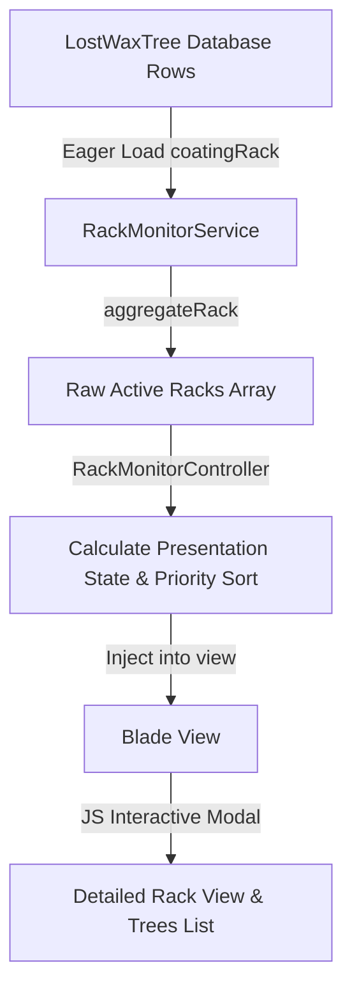

# Phase 3 — SPV Rack Dashboard

**Tanggal:** 2026-08-24  
**Scope:** UI Implementation for Lost Wax Coating Rack Dashboard  
**Status:** SELESAI & TERVERIFIKASI  

---

## 1. Overview & User Persona

### Tujuan Dashboard
Membantu Supervisor Coating (SPV Lapisan) Lost Wax menjawab pertanyaan operasional utama:
*   *"Rak mana yang harus saya keluarkan sekarang?"*
*   *"Mana yang akan siap sebentar lagi?"*
*   *"Rak mana yang sudah terlambat?"*

Dashboard ini didesain sebagai **Read-Only Operational Dashboard** dengan kepadatan informasi tinggi (high-density layout) agar SPV dapat melihat status puluhan rak sekaligus dengan cepat tanpa perlu melakukan navigasi mendalam.

### User Persona: SPV Coating / Lapisan
*   SPV tidak membutuhkan analitik yang rumit. Dia membutuhkan gambaran layaknya papan kereta di stasiun.
*   SPV menggunakan dashboard sebagai referensi instan untuk memberikan instruksi kepada operator (misal: *"Tolong keluarkan Rak 2, dia sudah matang"*).

---

## 2. Route & Controller

### Route
*   **Path:** `/lost-wax/rack-monitor`
*   **Named Route:** `lost-wax.rack-monitor.index`
*   **Middleware:** `auth` & `permission:access_execution` (di dalam prefix `lost-wax` group)

### Controller
*   **File:** `app/Http/Controllers/LostWax/RackMonitorController.php` [NEW]
*   **Dependency Injection:** Menyuntikkan `RackMonitorService` untuk mengambil data agregat rak secara efisien.
*   **Tanggung Jawab:**
    1.  Memanggil `RackMonitorService::getActiveRacks()` dan `RackMonitorService::getUnassignedTreeCount()`.
    2.  Melakukan klasifikasi **Presentation State** (`LATE`, `READY`, `NEAR_READY`, `NORMAL`) berdasarkan waktu umur rak dan konfigurasi threshold per-stage.
    3.  Melakukan pengurutan prioritas operasional (Priority Queue).
    4.  Membangun laporan ringkas jumlah rak per-stage (Stage & Aging Monitor) di memori PHP (0 extra DB queries).
    5.  Mengirimkan data ke Blade view `lost-wax.rack-monitor.index`.

---

## 3. Data Flow & Aggregation Source

### Aggregation & Performance (Preventing N+1)
*   Service mengekstrak tree yang aktif dan memiliki `rack_id` dengan eager loading `with('coatingRack')`.
*   Semua pengelompokan (`groupBy('rack_id')`), dominasi stage, mixed stage, split stage, dan ringkasan kode produksi diproses sepenuhnya dalam memori PHP.
*   Jumlah query database tetap konstan (2 query utama) terlepas dari jumlah rak yang aktif di lapangan (N+1 query mitigated).

---

## 4. Priority Queue & Aging Presentation Logic

### Priority Queue Sorting
Rak diurutkan secara menurun berdasarkan urgensi:
1.  **`LATE`** (Terlambat) — Rak yang umurnya melampaui `buffer_hours` konfigurasi tahapan dominan.
2.  **`READY`** (Siap Diproses) — Rak yang umurnya telah mencapai `min_hours` dan berada dalam acceptable window.
3.  **`NEAR_READY`** (Akan Siap) — Rak yang belum mencapai `min_hours` tetapi waktu tersisa menuju minimum &le; 60 menit.
4.  **`NORMAL`** (Normal) — Rak yang masih dalam proses pengeringan reguler (sisa waktu > 60 menit).

*Dalam kelompok prioritas yang sama, rak diurutkan berdasarkan `rack_age_minutes` secara descending (tertua/terlama tampil pertama).*

### Aging Calculations
*   **Umur Rak (`rack_age_minutes`):** Selisih waktu dari `Carbon::now()` dengan `MAX(last_scan_at)` dari tree-tree yang berada dalam dominant stage.
*   **Batas Waktu Tahapan (Stage-Specific):** Diambil dinamis dari `config('lost_wax.aging.stages.{stage}')` (misal: Layer 7 menggunakan threshold 24 jam / 26 jam, bukan fallback global 4 jam / 6 jam).
*   **Tampilan Sisa Waktu:**
    *   `LATE`: Menampilkan lama keterlambatan (`TERLAMBAT 43m`).
    *   `READY`: Menampilkan status `SIAP DIPROSES`.
    *   `NEAR_READY`: Menampilkan sisa menit menuju minimum (`Siap dalam: 21m`).
    *   `NORMAL`: Menampilkan durasi pengeringan yang tersisa (`Menuju siap: 2j 15m`).

---

## 5. Mixed Stage & Layer 7 Split Handlers

### Mixed Stage (`is_mixed = true`)
*   Terjadi jika rak berisi tree dengan tahapan yang berbeda.
*   Menampilkan badge `MIXED` berwarna oranye pada baris rak.

### Layer 7 Split (`is_layer7_split = true`)
*   Kondisi kritis operasional di mana sebagian tree harus masuk ke `layer_7` (karena `require_layer_7 = true`) dan sebagian lagi langsung dilewati ke `oven` (karena `require_layer_7 = false`).
*   Menampilkan badge `L7 SPLIT` berwarna ungu.
*   Modal detail menampilkan perbandingan distribusi tahapan (misal: `LAYER 6: 18 Tree`, `LAYER 7: 7 Tree`).

---

## 6. Interactive & High-Density UI Features

*   **Header Summary Bar:** Menampilkan visualisasi ringkas: *Total Rak Aktif*, *Terlambat*, *Siap Diproses*, *Akan Siap*, *Normal*, dan *Rak L7 Split*.
*   **Unassigned Trees Warning:** Jika ada tree aktif tanpa nomor rak, banner peringatan mencolok tampil di bagian atas untuk mendisiplinkan operator.
*   **Client-Side Filtering:** SPV dapat memfilter tampilan rak secara instan (Semua, Terlambat, Siap, Akan Siap, Normal) dengan mengklik tombol filter atau kotak summary di bagian atas. Filtering ini berjalan instan via JavaScript tanpa reload halaman.
*   **Dynamic Detail Modal:** Menampilkan ringkasan kode produksi (misal: `26AB001: 15 tree`) dan tabel detail barcode tree dalam rak tersebut. Data modal diambil dari data-attribute JSON pada card, bebas dari database query tambahan saat dibuka.
*   **Auto-Refresh:** Dashboard melakukan auto-reload setiap 60 detik untuk sinkronisasi waktu tanpa polling yang memberatkan server.

---

## 7. Verification & Test Results

### Automated Feature Tests
Sebanyak 7 test case baru telah dibuat di `tests/Feature/LostWax/RackMonitorDashboardTest.php`:
1.  **Access control:** Guest dialihkan ke login, sedangkan user SPV/authenticated dapat membuka `/lost-wax/rack-monitor`.
2.  **Priority queue ordering:** Memastikan rak `LATE` > `READY` > `NEAR_READY` > `NORMAL` terurut dengan benar.
3.  **Layer 7 override:** Memverifikasi threshold Layer 7 mematuhi 24 jam / 26 jam.
4.  **Mixed stage detection:** Menguji badge `MIXED` tampil pada data rack yang tidak seragam tahapan.
5.  **Layer 7 split detection:** Menguji badge `L7 SPLIT` tampil pada campuran tahapan kritis Layer 6/7/Oven.
6.  **Unassigned counter warning:** Menampilkan warning banner jika terdapat tree tanpa `rack_id`.
7.  **N+1 prevention:** Memastikan request dashboard hanya memicu jumlah query minimum yang konstan.

*Hasil `composer test` menunjukkan **269 Passed** (100% GREEN, tanpa regresi).*

### Manual Browser Verification
Dilakukan menggunakan browser subagent dengan skenario:
1.  Login menggunakan user PPIC/SPV (`adminppicpf@peroniks.com`).
2.  Membuka `/lost-wax/rack-monitor` -> data tampil dalam grid beresolusi tinggi dengan skema warna yang tepat.
3.  Membuka modal detail -> data detail tree dan production code summary terpopulasi dengan rapi.
4.  Menguji filter "Terlambat" -> baris tersaring instan menjadi hanya rak yang terlambat.

---

## 8. Known Limitations

1.  **Read-Only Dashboard:** Halaman ini murni untuk monitoring operasional. Segala bentuk perpindahan rak, void scan, dan scan stage harus tetap dilakukan melalui menu utama Lost Wax existing.
2.  **Physical Racks Count:** Layaknya lapangan nyata, monitor hanya menampilkan rak aktif (berisi tree). Rak kosong tidak memadati priority list.
